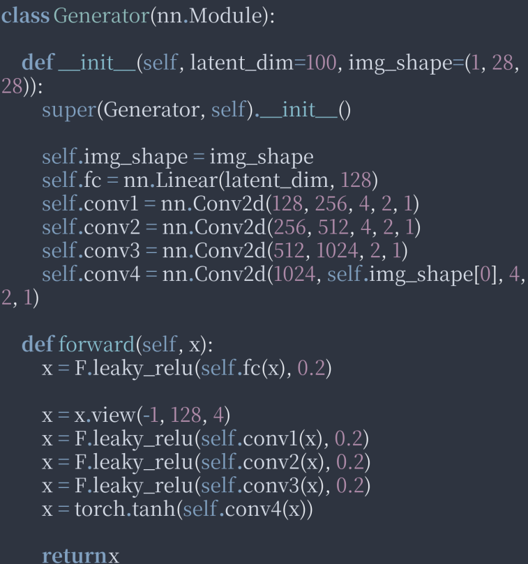

HandwrittenDigitalPicture.py文件中的代码是一个简单的 GAN（Generative Adversarial Networks）实现，用于生成手写数字图片。
```python
# 导入相关库
import torch
import torch.nn as n
import torch.optim as optim
import torch.nn.functional as F
from torch.utils.data import DataLoader
from torchvision import datasets, transforms
import matplotlib.pyplot as plt
import numpy as np
   ```
导入 PyTorch 和相关的库，包括：

   - `torch`: PyTorch 库。
   - `torch.nn`: PyTorch 中的神经网络模块。
   - `torch.optim`: PyTorch 中的优化器。
   - `torch.nn.functional`: PyTorch 中的函数式接口。
   - `torch.utils.data`: PyTorch 中的数据加载器。
   - `torchvision`: PyTorch 中的计算机视觉库。
   - `matplotlib`: Python 中的绘图库。
   - `numpy`: Python 中的数值计算库。

```python
# 定义生成器
class Generator(n.Module):

    def __init__(self, latent_dim, img_shape):
        super(Generator, self).__init__()

        self.img_shape = img_shape
        self.fc = n.Linear(latent_dim, 128)
        self.conv1 = n.Conv2d(128, 256, 4, 2, 1)
        self.conv2 = n.Conv2d(256, 512, 4, 2, 1)
        self.conv3 = n.Conv2d(512, 1024, 2, 1)
        self.conv4 = n.Conv2d(1024, self.img_shape[0], 4, 2, 1)

    def forward(self, x):
        x = F.leaky_relu(self.fc(x), 0.2)

        x = x.view(-1, 128, 4)
        x = F.leaky_relu(self.conv1(x), 0.2)
        x = F.leaky_relu(self.conv2(x), 0.2)
        x = F.leaky_relu(self.conv3(x), 0.2)
        x = torch.tanh(self.conv4(x))

        return x
   ```
这段代码定义了生成器模型。生成器是一个神经网络模型，用于从随机噪声 `z` 中生成图片。生成器模型包含以下几个层：

   - `torch.nn.Linear`: 全连接层，将随机噪声 `z` 映射到 128 维向量。
   - `torch.nn.Conv2d`: 卷积层，用于对生成器的 128 维向量进行卷积操作，生成特征图。
   - `torch.nn.LeakyReLU`: 激活函数，用于激活特征图。
   - `torch.nn.Tanh`: 激活函数，用于将输出范围缩放到 [-1, 1]。

```python
# 定义判别器
class Discriminator(n.Module):

    def __init__(self, img_shape):
        super(Discriminator, self).__init__()
        self.img_shape = img_shape
        self.conv1 = n.Conv2d(self.img_shape[0], 512, 4, 2, 1)
        self.conv2 = n.Conv2d(512, 256, 4, 2, 1)
        self.conv3 = n.Conv2d(256, 128, 4, 2, 1)
        self.fc = n.Linear(128 * 4, 1)


    def forward(self, x):
        x = F.leaky_relu(self.conv1(x), 0.2)
        x = F.leaky_relu(self.conv2(x), 0.2)
        x = F.leaky_relu(self.conv3(x), 0.2)
        x = x.view(-1, 128 * 4)
        x = self.fc(x)
        return x


   ```
这段代码定义了判别器模型。判别器是一个神经网络模型，用于判断输入的图片是否为真实图片。判别器模型包含以下几个层：

   - `torch.nn.Conv2d`: 卷积层，
1. 首先，定义了一个Discriminator类，继承自nn.Module，用于构建判别器模型。

2. 接着，在__init__函数中，定义了四个卷积层和一个全连接层，用于构建判别器模型。

3. 最后，在forward函数中，定义了前向传播过程，将输入x通过四个卷积层和一个全连接层，最终得到输出x。

```python
# 定义损失函数
def los_func(real_score, fake_score):
    real_los = torch.mean((real_score - 1) * 2)
    fake_los = torch.mean(fake_score * 2)
    return real_los + fake_los


# 定义训练函数
def train(dataloader, discriminator, generator, device, optimizer_d, optimizer_g, los_func):
    discriminator.train()
    generator.train()
    for real_img, _ in dataloader:
        batch_size = real_img.size(0)
    real_img = real_img.to(device)
    # 训练判别器
    optimizer_d.zero_grad()
    # 生成噪声
    z = torch.randn(batch_size, latent_dim).to(device)
    # 生成假图片
    fake_img = generator(z)
    # 计算真实图片的分数
    real_score = discriminator(real_img)
    # 计算假图片的分数
    fake_score = discriminator(fake_img)
    # 计算损失
    d_los = los_func(real_score, fake_score)
    # 反向传播
    d_los.backward()
    optimizer_d.step()
    # 训练生成器
    optimizer_g.zero_grad()
    # 生成噪声
    z = torch.randn(batch_size, latent_dim).to(device)
    # 生成假图片
    fake_img = generator(z)
    # 计算假图片的分数
    fake_score = discriminator(fake_img)
    # 计算损失
    g_los = los_func(real_score, fake_score)
    # 反向传播
    g_los.backward()
    optimizer_g.step()
   ```
```python
# 定义损失函数
def los_func(real_score, fake_score):
    real_los = torch.mean((real_score - 1) * 2)
    fake_los = torch.mean(fake_score * 2)
    return real_los + fake_los
```

这段代码定义了损失函数，用于计算判别器和生成器的损失。损失函数包括以下几个部分：

   - `real_score`: 真实图片的分数。
   - `fake_score`: 假图片的分数。
   - `real_los`: 真实图片的损失，计算方式为(real_score - 1) * 2)
   - `fake_los`: 假图片的损失，计算方式为fake_score * 2
   - `return`: 返回真实图片和假图片的损失之和。

```python
# 定义训练函数
def train(dataloader, discriminator, generator, device, optimizer_d, optimizer_g, los_func):
    discriminator.train()
    generator.train()
    for real_img, _ in dataloader:
        batch_size = real_img.size(0)
    real_img = real_img.to(device)
    # 训练判别器
    optimizer_d.zero_grad()
    # 生成噪声
    z = torch.randn(batch_size, latent_dim).to(device)
    # 生成假图片
    fake_img = generator(z)
    # 计算真实图片的分数
    real_score = discriminator(real_img)
    # 计算假图片的分数
    fake_score = discriminator(fake_img)
    # 计算损失
    d_los = los_func(real_score, fake_score)
    # 反向传播
    d_los.backward()
    optimizer_d.step()
    # 训练生成器
    optimizer_g.zero_grad()
    # 生成噪声
    z = torch.randn(batch_size, latent_dim).to(device)
    # 生成假图片
    fake_img = generator(z)
    # 计算假图片的分数
    fake_score = discriminator(fake_img)
    # 计算损失
    g_los = los_func(real_score, fake_score)
    # 反向传播
    g_los.backward()
    optimizer_g.step()
   ```

这段代码定义了训练函数，用于训练 GAN 模型。训练函数包括以下几个部分：

   - `dataloader`: 数据加载器。
   - `discriminator`: 判别器模型。
   - `generator`: 生成器模型。
   - `device`: 训练设备。
   - `optimizer_d`: 判别器优化器。
   - `optimizer_g`: 生成器优化器。
   - `los_func`: 损失函数。
   - `real_img`: 真实图片。
   - `batch_size`: 批量大小。
   - `z`: 随机噪声。
   - `fake_img`: 生成的假图片。
   - `real_score`: 真实图片的分数。
   - `fake_score`: 假图片的分数。
   - `d_los`: 判别器的损失。
   - `g_los`: 生成器的损失。
   - `latent_dim` 是一个超参数，表示生成器输入的潜在空间的维度，通常也称为“噪声向量”的长度。
在上述代码中，`latent_dim` 应该是在训练函数之外定义的一个常数或变量。如果在运行这段代码之前没有定义 `latent_dim`，则会报出 `NameError: name 'latent_dim' is not defined` 的错误。

因此，需要在训练函数之外定义一个 `latent_dim` 变量或常数，并赋予一个具体的值,如：
```python
latent_dim = 100
```

```python
# 定义可视化函数
def visualize(generator, device, n_row=5, figsize=(5, 5)):
    generator.eval()
    # 生成噪声
    z = torch.randn(n_row * 2, latent_dim).to(device)
    # 生成假图片
    fake_img = generator(z)
    # 可视化
    fig, axes = plt.subplots(n_row, figsize=figsize)
    for ax, img in zip(axes.flaten(), fake_img):
        ax.axis('of')
    ax.set_adjustable('box-forced')
    ax.imshow(img.cpu().data.view(img_shape).numpy(), cmap='gray', aspect='equal')
    plt.subplots_adjust(wspace=0, hspace=0)
    plt.show()
    # 定义参数
    img_shape = (1, 28)
    latent_dim = 10
    # 加载数据
    transform = transforms.Compose([
        transforms.ToTensor(),
        transforms.Normalize(mean=(0.5,), std=(0.5,))
    ])
    dataloader = DataLoader(
        datasets.MNIST('data', train=True, download=True, transform=transform),
        batch_size=64,
        shufle=True
    )
    # 定义模型
    device = torch.device('cuda' if torch.cuda.is_available() else 'cpu')
    generator = Generator(latent_dim, img_shape).to(device)
    discriminator = Discriminator(img_shape).to(device)
    # 定义优化器
    optimizer_d = optim.Adam(discriminator.parameters(), lr=0.02, betas=(0.5, 0.9))
    optimizer_g = optim.Adam(generator.parameters(), lr=0.02, betas=(0.5, 0.9))
    # 训练模型
    epochs = 20
    for epoch in range(epochs):
        train(dataloader, discriminator, generator, device, optimizer_d, optimizer_g, los_func)
    if epoch % 10 == 0:
        print(
            f'epoch: {epoch}, d_los: {train.d_los.item()}, g_los: {train.g_los.item()}'
        )
    # 可视化
    visualize(generator, device)
```
这段代码定义了visualize可视化函数:
1. 首先定义可视化函数，用于生成假图片并可视化；
2. 然后定义参数，包括图片的形状和潜在空间的维度；
3. 接着加载数据，并定义模型，将模型放置在GPU上；
4. 然后定义优化器，用于优化模型；
5. 接着训练模型，每10个epoch输出一次损失值；
6. 最后可视化，将生成的假图片可视化出来。

img_shape是一个元组，它表示图像的形状，在这里是(1, 28)，表示图像的高度为1，宽度为28。 
它用于定义生成器和鉴别器的输入和输出的形状，以便它们可以正确地处理图像数据。
用于指定生成图像的大小，例如（1，28）表示生成的图像是1行28列的灰度图像。
要解决这个问题，可以根据需要更改img_shape的值，以指定生成的图像的大小。

```python
class Generator(nn.Module):

    def __init__(self, latent_dim=100, img_shape=(1, 28, 28)):
        super(Generator, self).__init__()

        self.img_shape = img_shape
        self.fc = nn.Linear(latent_dim, 128)
        self.conv1 = nn.Conv2d(128, 256, 4, 2, 1)
        self.conv2 = nn.Conv2d(256, 512, 4, 2, 1)
        self.conv3 = nn.Conv2d(512, 1024, 2, 1)
        self.conv4 = nn.Conv2d(1024, self.img_shape[0], 4, 2, 1)

    def forward(self, x):
        x = F.leaky_relu(self.fc(x), 0.2)

        x = x.view(-1, 128, 4)
        x = F.leaky_relu(self.conv1(x), 0.2)
        x = F.leaky_relu(self.conv2(x), 0.2)
        x = F.leaky_relu(self.conv3(x), 0.2)
        x = torch.tanh(self.conv4(x))

        return x
```
在以上代码中，如果不传入`latent_dim`和`img_shape`的值，就会使用默认值`100`和`(1, 28, 28)`。如果需要使用其他默认值，可以在函数定义时设置。
如图：
